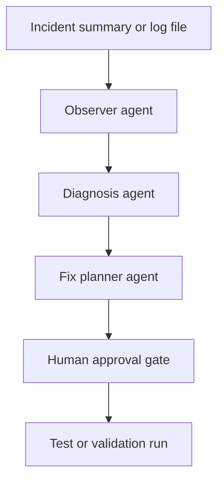

# 🤝 Multi-Agent Log-to-Fix Workflow

## ❓ Question This File Answers

*Wanted have a demo on how to setup agentic development where 2-3 agents talk to each other to complete a task (e.g., Log error -> instruct agent to fix). Using models running locally on Ollama.*

## 📝 Summary

A multi-agent workflow is most effective when each agent has a single responsibility and a
human approves changes before they are applied.

## ✅ Recommended Approach

Model the workflow as three roles: Observer, Diagnosis, and Fix Planner. If separate
agents are not available, simulate the same pattern with named prompts and sequential
handoffs.

## 🧠 Why This Approach Fits

- It keeps the workflow easy to explain.
- It shows the value of orchestration without relying on a single oversized prompt.
- It demonstrates autonomy while preserving change control.

## 🔄 Suggested Workflow



## 💬 Example Agent Prompts

### 👀 Observer agent

```text
Read the incident summary and logs. Return the affected service, the most likely error
signature, the time window that matters, and the files or modules that should be
checked.
```

### 🧪 Diagnosis agent

```text
Using the observer output plus the relevant code, explain the most likely root cause.
Return one primary hypothesis, one alternate hypothesis, and the best validation step.
```

### 🛠️ Fix planner agent

```text
Prepare the smallest safe fix for the confirmed root cause. Include the code change,
test change, and rollback considerations. Do not apply anything until approved.
```

## 🧪 Implementation Guidance

- Use a small repository with a known bug and a failing test.
- Keep the incident input small and deterministic so the handoffs are easy to follow.
- Define a simple contract for each step, such as summary, confidence, and next action.
- If full orchestration is not available, run the same flow manually with named roles.

## 🛡️ Guardrails

- Keep a human gate before any code modification or merge.
- Use safe, synthetic inputs for initial rollout and validation.
- Avoid framing unattended autonomous code changes as a production default.

## 🔑 Key Takeaway

The value of multi-agent workflows is not the number of agents. It is the clarity of the
handoff, the scope of each role, and the discipline of the approval gate.
